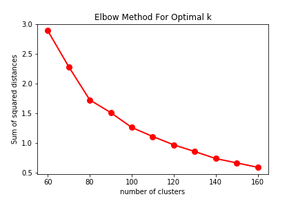

### Consigna:
En un corpus de texto general **en castellano**, encontrar grupos de palabras que puedan ser usados como clases de equivalencia.

### Clustering is comming
Para la obtención de clusters en este trabajo se realizaron los siguientes pasos:
##### Preprocesamiento
El corpus utilizado fue obtenido de SBWCE<sup>1</sup>, al mismo se le eliminaron las palabras denominadas *stopwords*, la palabra *DIGITO* y los documentos que tenian menos de 8 palabras.
Se utilizo la libreria [spacy](https://spacy.io/), la cual tiene implementado un *pipeline*  que consiste en varios procedimientos, para esta tarea se utilizo el procedimiento de *tagger* es decir a cada palabra se le identifico su categoria gramatical<sup>2</sup>, y el procedimiento de *parser* el cual hace un analisis de las dependencias.

##### Seleccion de caracteristicas
Luego de preprocesar el corpus, se extrajo de cada *token* caracteristicas que posee el mismo, esto se represento por medio de un diccionario, el cual contiene lo siguiente:
```python
{   'word':     value,
    'pos':      value,
    'lemma':    value,
    'is_lower': value,
    'dt':       value,
    'pre_word': value,
    'pos_word': value
}
```
donde *word* es el string del token, *POS* part-of-speech tags del token, *lemma* forma canonica del token, *is_lower* si el token esta en minuscula, *dt* representa las tripla de dependencia, *pre_word* el token anterior, *pos_word* token posterior(tamaño de ventana uno).

Una situacion que surge con esta forma de representar las caracterisitcas de las palabras es que al generar el diccionario de features de cada token, la ocurrencia de una palabra ya procesada tendra su propias caracteristicas, como consecuncia puede causar que en distintos cluster aparezcan las mismas palabras.
##### Vectorizado
Para el vectorizado de las caracteristicas se utilizo ```Dictvectorizer()``` de sklearn.
##### Reduccion de dimensionalidad
Para la reduccion de la dimensionalidad se utilizo ```TruncatedSVD()``` de sklearn, el cual implementa LSA.

##### Grafico de elbown

Se ultizo el metodo de elbow para tratar de elegir un numero optimo de cluster, el cual se realizo varias iteraciones de kmeans con distintos numeros de cluster en el  que se observaba la inercia, la suma de las distancias al cuadrado de cada objeto del cluster a su centroide.

A medida que aumentamos la cantidad de cluster el valor de la inercia va disminuyendo.
En el siguiente grafico podemos ver la inercia de cada cluster, se considero como numero optimo de cluster 82.



##### Clustering

Finalmente se utilizo Kmeans de sklearn para obtener los clusters.
Se configuro el parametro ```random_state = 256``` para en un futuro poder obtener los mismos clusters si se quiere repetir el experimento.

### Conclusiones

Debido a que el tamaño de los corpus son demasiados grandes, en este proyecto se utilizaron 200 documentos para poder hacer un analisis mas rapido de clusters obtenidos.
Se crearon clusters utilizando reduccion de dimensionalidad y sin hacer reduccion de dimensionalidad. 

Realizando reduccion de dimensionalidad mostramos algunos de los clusters obtenidos:

En este cluster se pueden ver palabras con sus respectivas abreviaciones.
```
 76: {'agencias', 'centímetros', 'cm', 'milímetros', 'mm'}
``` 
En el siguiente cluster se pueden observar varias palabras referidas al futbol.
```
 43: {'Armada', 'Batalla', 'CGT', 'Conferencia', 'Conmebol', 'Copa', 'Cuarta', 'FIFA', 'Federación', 'Histoire', 'IC', 'IIIa', 'ISR', 'Isla', 'Liga', 'Museo', 'República', 'Révolution', 'SFIC', 'Tierra', 'UEFA', 'Universidad', 'VO', 'Verité'}
```
En el siguiente cluster se pueden observar meses del año.
```
63: {'abril', 'bateo', 'corrector', 'diciembre', 'estudiantes', 'febrero', 'fructificación', 'guerra', 'julio', 'noviembre', 'observación', 'octubre', 'oxidación', 'restos'}
```
### Referencias

1.[Cristian Cardellino: Spanish Billion Words Corpus and Embeddings (March 2016)]( https://crscardellino.github.io/SBWCE/).

2.[Categoria Gramatical](https://es.wikipedia.org/wiki/Categor%C3%ADa_gramatical).
